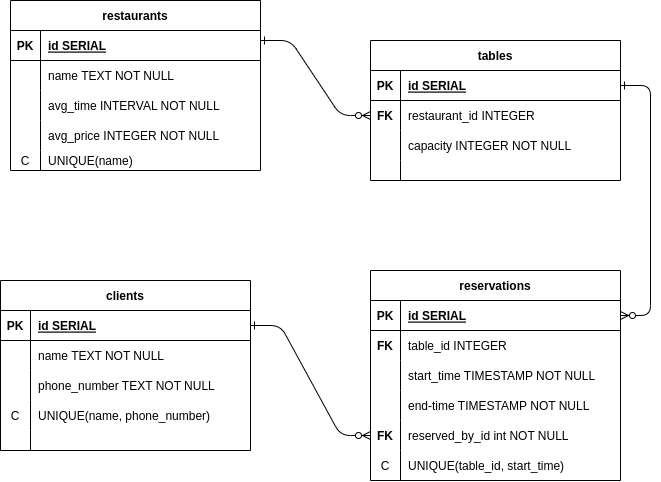

# Документация

---

## Пакеты

1. ### app

Пакет отвечает за запуск сервера

__Функции__:
- `Run(cfg *config.Config)` _запускает приложение_

2. ### config

Пакет отвечает за чтение переменных из .env файла и создания структуры Config

__Структуры__:

```go
type Config struct {
	DB_host     string
	DB_port     string
	DB_name     string
	DB_user     string
	DB_password string
	App_host    string
	App_port    string
	Main_dir    string
}
```

__Функции__:

- `NewConfig() *Config`

3. ### delivery

Пакет delivery отвечает за создание end-point'ов приложения и их обработку

__Функции__:

- `NewRouter(db *sql.DB) *gin.Engine` _создает gin.Engin обект, который отвечает за маршрутизацию запростов и ответов_

- `MakeHandler(handlerName string, db *sql.DB) func(c *gin.Context)` _Cоздает обработчики для end-point'ов, нужна для того что бы пробросить указатель на БД внуть обработчиков и обработчики удовленворяли сигнатуре `gin.HandlerFunc`_

4. ### drop

Пакет drop отвечает за очищение БД при завершении работы приложения

__Функции__:

- `Cleanup(cfg *config.Config) func()` _Функция, очищающая БД, вызывается при получении сигнала `SIGINT`_

5. ### selection

Пакет отвечает за оптимальный выбор столиков для бронировани

__Функции__:

- `SelectTables(db *sql.DB, volume, appropriateTime string) (map[string][]structures.Table, error)` _выбирает столики(или их комбинации), которые подходят по времени и по вместимости_

6. ### storage

Пакет отвечает за хранение данных и взаимодействия с базой данных

__Функции__:

- `NewDB(cfg *config.Config) *sql.DB` _создает новый экземпляр `sql.DB`, а так же создает таблицы и заполняет их тестовыми данными_

- `FillDB(cfg *config.Config, db *sql.DB)` _заполняет БД содержимым (в том числе, тестовым)_

- `ExecFromFile(cfg *config.Config, db *sql.DB, file_name string) error` _исполняет команды из файла file_name, хранящегося в директории /pkg/database/postgresql/storage/_

- `GetRestaurants(db *sql.DB) ([]structures.Restaurant, error)` _получает из БД данные о ресторанах_

- `GetTablesByTime(db *sql.DB, t time.Time) ([]structures.Table, error)` _получает из БД столики, которые свободны на момент t_

- `PostReservations(db *sql.DB, rawReservation structures.RawReservation) (structures.Reservation, error)` _добавляет новую бронь в БД_

- `AddClient(db *sql.DB, rawClient structures.RawClient) (structures.Client, error)` _добавляет нового клиента в БД_

- `GetClientByRaw(db *sql.DB, rawClient structures.RawClient) (structures.Client, error)` _получет из БД данные о клиенте по его имени и номеру телефона_

7. ### structures

Пакет structures содержит используемые в приложении структуры

__Структуры__:

```go
// Структура, которая возвращается из
// таблицы clients
type Client struct {
	ID    string `json:"id"`
	Name  string `json:"name"`
	Phone string `json:"phone_number"`
}

// Структура, которая передается как поле
// при запросе на бронирование столика
type RawClient struct {
	Name  string `json:"name"`
	Phone string `json:"phone_number"`
}
```

```go
// Структура, которая возвращается из
// таблицы reservations
type Reservation struct {
	ID          string `json:"id"`
	Table_id    string `json:"table_id"`
	Start_time  string `json:"start_time"`
	End_time    string `json:"end_time"`
	Reserved_by string `json:"reserved_by"`
}

// Структура, которая передается при
// запросе на бронирование столика
type RawReservation struct {
	Table_id    string    `json:"table_id"`
	Start_time  string    `json:"start_time"`
	Reserved_by RawClient `json:"reserved_by"`
}
```

```go
// Структура, которая возвращается из
// таблицы restaurants
type Restaurant struct {
	ID        string `json:"id"`
	Name      string `json:"name"`
	Avg_time  string `json:"avg_time"`
	Avg_price int    `json:"avg_price"`
}
```

```go
// Структура, которая возвращается из
// таблицы tables
type Table struct {
	ID            string `json:"id"`
	Restaurant_id string `json:"restaurant_id"`
	Capacity      int    `json:"capacity"`
}
```

## Модель данных



```sql
CREATE TABLE restaurants (

	id SERIAL PRIMARY KEY, 		-- уникальный индентификатор

	name TEXT NOT NULL,			-- название ресторана

	avg_time interval NOT NULL, -- среднее время ожидания

	avg_price integer NOT NULL, -- средний чек

	UNIQUE(name)				-- констрейнт, не позволяющий
);								-- добавлять одинаковые рестораны

CREATE TABLE tables (

	id SERIAL PRIMARY KEY,		-- уникальный идентификатор

	-- ресторан, в котором находится столик
	restaurant_id integer REFERENCES restaurants (id),

	capacity integer NOT NULL	-- вместимость столика
);

CREATE TABLE clients (

	id SERIAL PRIMARY KEY,		-- уникальный идентификатор

	name TEXT NOT NULL,			-- имя

	phone_number TEXT NOT NULL, -- номер телефона

	UNIQUE (name, phone_number)	-- констрейнт, не позволяющий
);								-- добавлять одинаковых клиентов

CREATE TABLE reservations (

	-- уникальный идентификатор
	id SERIAL PRIMARY KEY,

	-- столик, за которым закреплениа бронь
	table_id integer REFERENCES tables (id),

	-- начало действия брони
	start_time timestamp NOT NULL,

	-- конец действия брони (начало + 2 часа)
	end_time timestamp NOT NULL,

	-- id клиента за которым закреплена бронь
	reserved_by int REFERENCES clients (id), 

	-- констрейнт, не позволяющий:
	-- во-первых, создавать одинаковые брони
	-- во-вторых, двум клиентам бронировать
	-- один и тот же столик на одно и то же время
	UNIQUE (table_id, start_time)
);
```